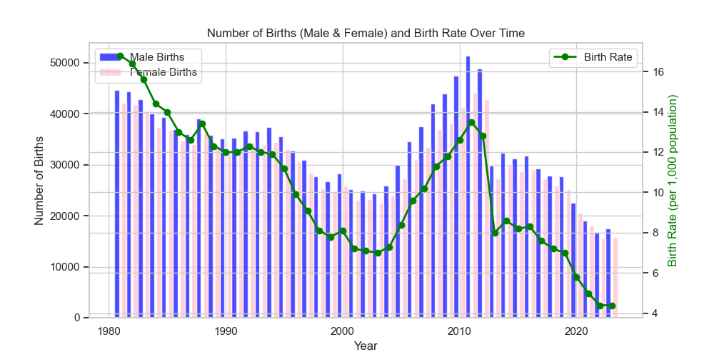

# Install Virtual Environment
```
python3 -m venv venv
```

# Activate Virtual Environment
```
source venv/bin/activate
```

# Install Package
```
pip install -r requirements.txt
```

# Run the Program
```
python BirthRate.py
```
### You can get the result like this:


# Deactivate Virtual Environment
```
deactivate 
```
